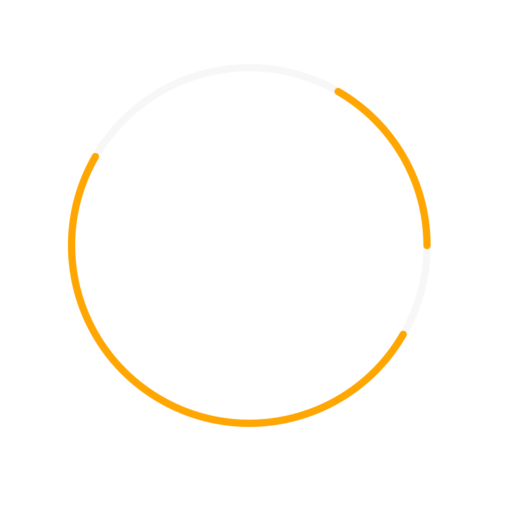

## react-native-circles 

React native `Circle` and `Arc` component that displays array of arcs in a circle.


## Install
```
npm install react-native-circles
```

## Prerequisites


This library uses [react-native-svg](https://github.com/react-native-community/react-native-svg) to render its graphs. Therefore this library needs to be installed AND linked into your project to work.

Other than the above dependency this library uses pure javascript and supports both iOS and Android


## Usage

```
import React from 'react';
import { View } from 'react-native';
import { MultiArcCircle } from 'react-native-circles';

export default class CircleExample extends React.Component {
  render() {
    return (
      <View style={{
        flex: 1,
        justifyContent: 'center',
        alignItems: 'center'
      }}>
        <MultiArcCircle
          radius={100}
          intervals={[
            { start: 30, end: 90 },
            { start: 120, end: 300 }
          ]}
          color='orange'
          backgroundColor='#f7f7f7'
          width={4}
        />
      </View>
    );
  }
}
```

### Common props:

Name            | Description  
----------------|-----------------------------
width           | width of the ring    
radius          | radius of the ring   
color           | color for arcs that are described by intervals props    
backgroundColor | color of the ring     
intervals       | Array of objects({ start: angle, end: angle }) that describe arcs